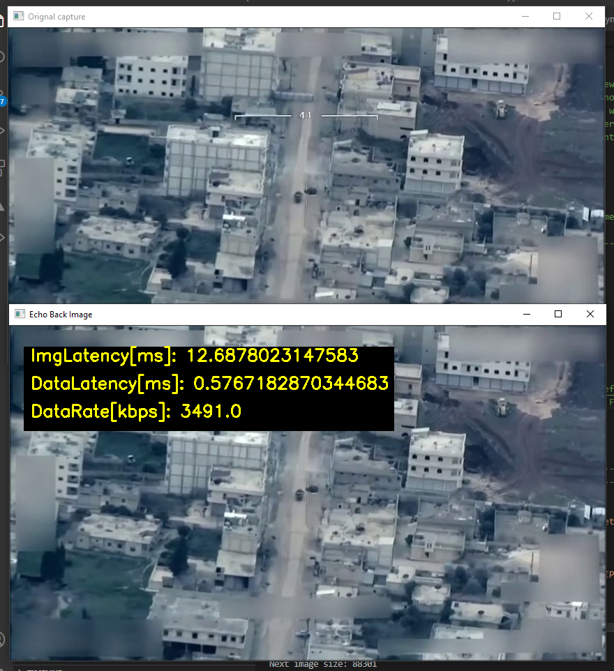
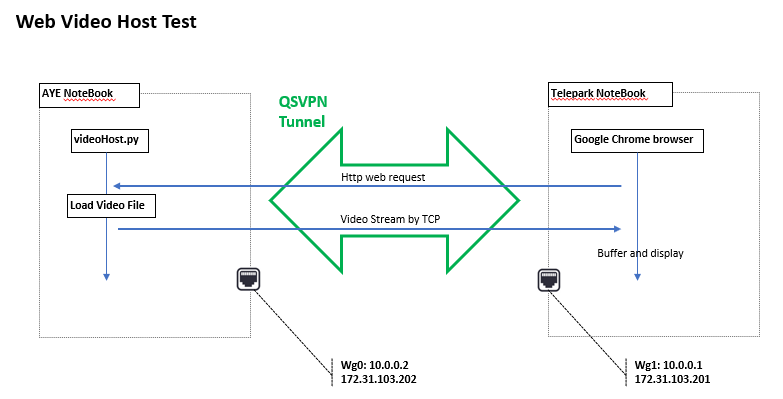
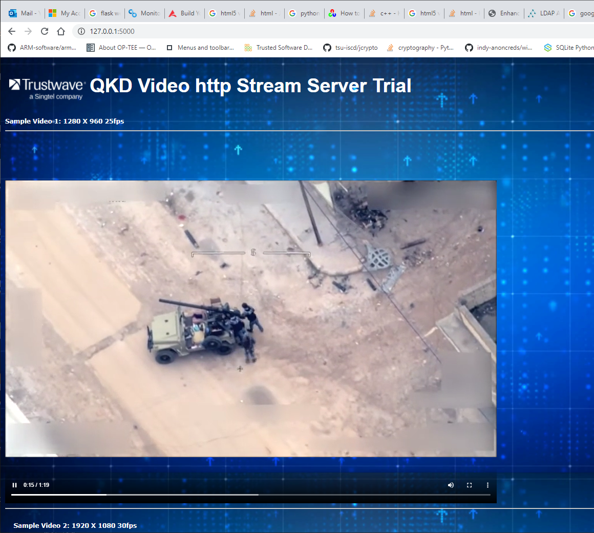

# Video Test Program.

#### Introduction

This project is aim to test different video/Image processing, such as target detection, image encode/decode for data transfer.

[TOC]

#### Test_case 1: Use Iperf3 to test the network throughputs

**Iperf3** setup link:  https://www.tecmint.com/test-network-throughput-in-linux/

Server side:  

```shell
$ iperf3 -s
```

Client side: 

```shell
$ iperf3 -c 173.31.123.202
```


------

#### Test_case 2: Camera Echo Test Program

##### 2.1 Introduction

This program will create a camera/video viewer which used to test the image/data transfer latency between 2 nodes in a network. It will display the camera view/video in one window the send the data to the other side of the network. The other side <camEchoClient.py> will echo send the data back, then the sent back data will show on another window.

###### Program work flow:


###### Program user interface view (Camera Mode):


###### Program user interface view (Video Mode):



##### 2.2 Program Setup

###### Development Environment

> Python 3.7.4

###### Additional Lib Need

Camera server side: Opencv: https://pypi.org/project/opencv-python/

```
pip install opencv-python
```

###### File Structure

| Server side         | Client Side      |
| ------------------- | ---------------- |
| camEchoServer.py    | camEchoClient.py |
| udpCpom.py          | udpCpom.py       |
| camServerConfig.txt |                  |
| test.mp4            |                  |

###### Program File List 

| Program File        | Execution Env | Description                                                  |
| ------------------- | ------------- | ------------------------------------------------------------ |
| camEchoClient.py    | python3.7     | This module will create UDP echo server program which will send back the data back to the source on port 5005. |
| camEchoServer.py    | python3.7     | This module will create a camera/video viewer which used to test the image/data transfer latency between 2 nodes in a network. It will display the camera view/video in one window the send the data to the other side of the network. |
| udpCom.py           | python3.7     | This module will provide a UDP client and server communication API. |
| udpComTest.py       | python3.7     | This module will provide a muti-thread test case program to test  the UDP communication modules by using port 5005. |
| camServerConfig.txt |               | The configuration file used to set the camEchoClient ipaddress, video frame rate and other parameters. |
| test.mp4            |               | H264 video used to test the video data transfer.             |


##### 2.3 Program Usage

Run the Program on Client machine(The client machine needs to run first): 

```
python3 camEchoClient.py
```

Run the Program on server machine(The client machine needs to run first): 

```
1. Set the test mode flag [TEST_MD]in camEchoServer.py line 29: 
True - use pre-saved video
False - capture from camera.
2. Change the IP addres in camServerConfig.txt to the client machine's IP and adjust the sending frame rate.
3. python3 camEchoServer.py
```


------

#### **Test_case 3: Use VLC Player to create the video stream host**

Convert the video to H264 format : https://www.vlchelp.com/convert-video-format/

Server side to push the video stream:  

```sh
$ vlc -vvv -Idummy "/home/test/Videos/test.wmv" --sout='#transcode{vcodec=h264,acodec=mp3,ab=128,channels=2,samplerate=44100}:http{dst=:8090/go.mpg}'
```

or loop play: 

```sh
$ vlc --loop -vvv -Idummy "/home/test/Videos/test.wmv" --sout='#transcode{vcodec=h264,acodec=mp3,ab=128,channels=2,samplerate=44100}:http{dst=:8090/go.mpg}'
```

Client side to get the video stream: 

```shell
$ vlc http://172.31.103.202:8090/go.mpg

$ vlc http://10.0.0.1:8090/go.mpg
```

Client Side view: 


------

#### Test_case 4: Video host web program 

##### 4.1 Introduction 

This program will run as a video web host. The video will be smooth as the HTML default video API will buffer the data then play the video (you can see the buffer progress bar below the play progress bar. When I used wireShark to capture the traffic we can see the server keep pushing the data, at the beginning there are some data transferred, but if the data is not reached to the data buffer threshold, the browser will not show the video, this will more obvious when you play Peter's 1080p full HD UAV video).

###### Program work flow:



###### Webpage view:



##### 4.2 Program Setup

###### Development Environment

> Python 3.7.4

###### Additional Lib Need

flask : https://pypi.org/project/Flask/

##### 4.3 Run the program: 

Copy the video folder[videoSrc] in to the server computer, and cd to the videoSrc folder. 

```
python3 videoHost.py
```

On the client computer open browser and type in url :http://<serverIP>:5000/ 

For local test use:  http://127.0.0.1:5000/


------

> Last edit by LiuYuancheng(liu_yuan_cheng@hotmail.com) at 15/03/2021

