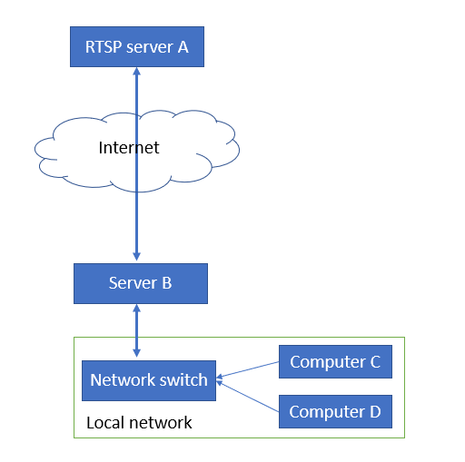
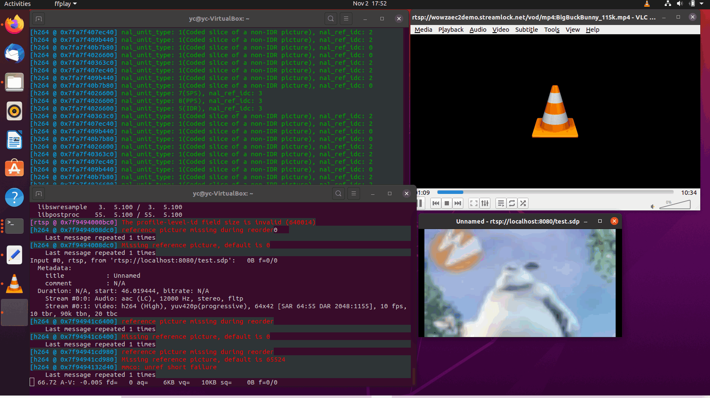

## Forward RTSP Video Stream


#### Introduction 

Assume we have one Real Time Streaming Protocol Server (A) on the internet, and we have a server (B) with 2 network interfaces, one side connected to the internet and the other side is connect to a LAN. Then in the LAN we also have 2 computers (C & D) which want to view the video. As shown below:



So what should we set one server-B so the computer C and D can view the 

#### Solution 

We can run the VLC on server B and forward the RTSP stream to C and D, which means the server B will run as a RTSP server and take the server-A video stream as input. 

###### Test environment 

Server A we we the online rtsp test link: 

```
rtsp://wowzaec2demo.streamlock.net/vod/mp4:BigBuckBunny_115k.mp4
```

Run the RTSP server cmd on the server-B side: 

```
vlc -vvv rtsp://wowzaec2demo.streamlock.net/vod/mp4:BigBuckBunny_115k.mp4 --sout="#transcode{vcodec=h264,vb=800,scale=0.25,fps=10}:rtp{dst=127.0.0.1,port=444‌​4,sdp=rtsp://localhost:8080/test.sdp}"
```

Run the RTSP fetch on the computer C and D, in our test we use local host to test

```
ffplay rtsp://localhost:8080/test.sdp
```

###### Result



#### Reference

VLC cmd: https://wiki.videolan.org/Documentation:Streaming_HowTo/Command_Line_Examples/

RTSP to RTSP: 

vlc:  https://superuser.com/questions/85170/using-vlc-as-rtsp-server

ffmpeg: https://www.reddit.com/r/ffmpeg/comments/g2lvrd/ffmpeg_forwarding_rtsp_to_rtsp/fovmhn2/